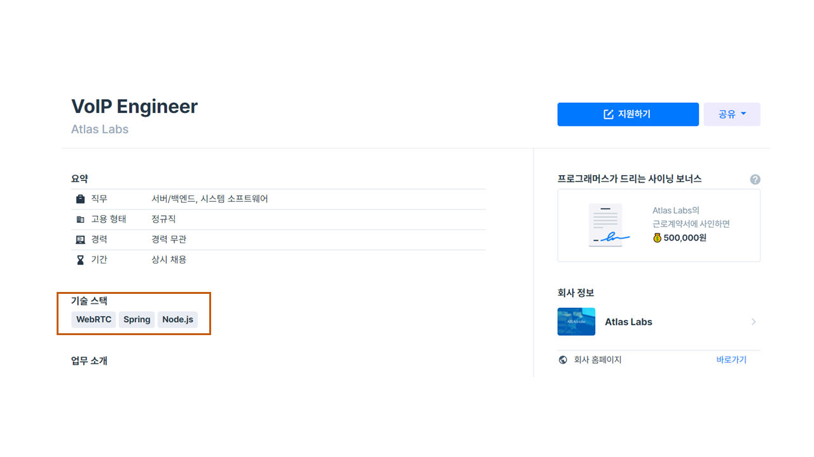
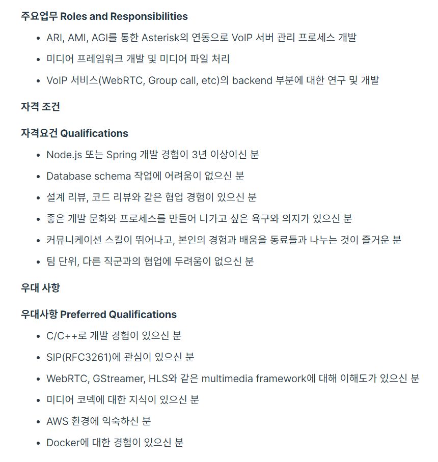

# TechStack

## Programmers

* https://programmers.co.kr/job에 올라와 있는 채용공고에서 기술 스택을 종류별로 Count한다.

* 현재는 채용공고를 올린쪽이 등록한 기술스택만 Count하고 있지만 프로젝트가 진행되면 자격조건과 우대사항에 있는 Text에서 회사가 중요시하는 기술스택이나 키워드를 Count하고 직무별로 통계를 내는것이 목표.

## Rocketpunch

* https://www.rocketpunch.com/jobs 로켓펀치 채용공고 페이지는 Dynamic Web Page이기때문에 BeautifulSoup으로는 크롤링이 불가능한 상황.
* Selenium을 사용해 크롤링 할 예정.

