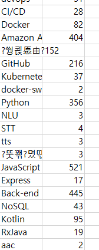
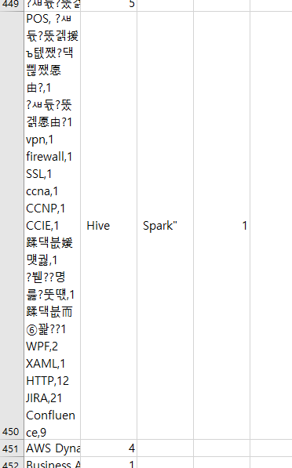
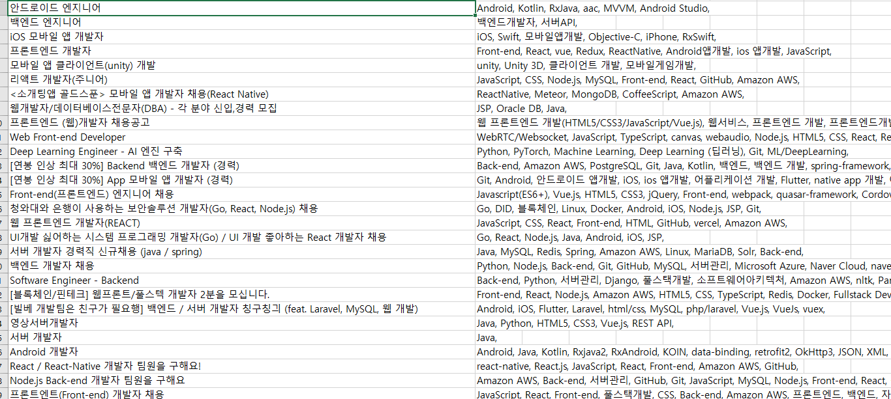
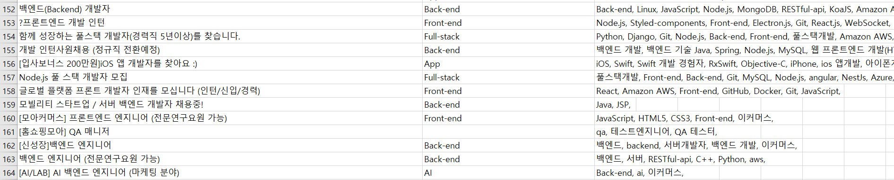

# TechStack

## Programmers

* https://programmers.co.kr/job에 올라와 있는 채용공고에서 기술 스택을 종류별로 Count한다.

* 현재는 채용공고를 올린쪽이 등록한 기술스택만 Count하고 있지만 프로젝트가 진행되면 자격조건과 우대사항에 있는 Text에서 회사가 중요시하는 기술스택이나 키워드를 Count하고 직무별로 통계를 내는것이 목표.

## Rocketpunch

* https://www.rocketpunch.com/jobs 로켓펀치 채용공고 페이지는 Dynamic Web Page이기때문에 BeautifulSoup으로는 크롤링이 불가능한 상황.
* Selenium을 사용해 크롤링 할 예정.

# 2021-02-03

### Rocketpunch

* Selenium을 이용해 크롤링 구현.

* ~~비정상적인 데이터들이 포함되어 있어 해결 필요.~~
* UTF-8 파일을 Excel에서 열 때 생기는 문제로 확인. UTF-8을 ANSI로 바꾸어 해결.

#### 기술 스택으로 해당 채용공고의 직무 예측하기

* 채용공고의 기술 스택을 보고 채용공고에서 모집하는 직무를 예측하는 프로그램을 만들기 위해서 채용공고의 Title로 해당 채용공고의 직무를 분류하여 학습용 데이터를 만들 예정.
* 기술 스택은 One-Hot Encoding으로 표현 할 예정.

# 2021-02-11

* 지도학습을 진행하기 위해 기술스택과 채용공고의 제목을 이용해서 직무를 직접 분류했다.
  * 여러 직무를 하나의 채용공고에서 구하는 경우는 제외했다.
  * 대부분이 App, Front-end, Back-end, Full-stack이고 AI, Datascience, Game, Publishing, Database 등이 한 두번 나온다.
  * 직무의 분류 범위를 설정하고 직무 목록을 먼저 만들어야 정확하게 학습 데이터를 만들 수 있을 것 같다. ex) Android와 IOS를 APP 하나로 묶을지 각각 직무로 분류할 지.
* 직접 분류하는데 한계가 있어 기술스택으로 Clustering을 한 후에 Cluster에 이름을 정하는것이 더 빠를것으로 예상된다. 